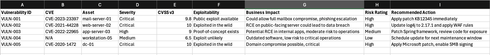

# 👋🏾 Hi, I’m Toluwanimi

I’m a cybersecurity and IT professional passionate about using technology to protect and empower people.  
Currently exploring SOC automation, threat detection, and vulnerability management.  
On this page, you’ll find projects related to:
- Security monitoring and log analysis
- Python automation for incident response
- Network and vulnerability management
- Cloud security and compliance insights

# Vulnerability Management Case Study
**Folder:** `tenable-vuln-report`  
**Objective:** Demonstrate end-to-end understanding of the vulnerability management lifecycle — from discovery to remediation.

---

## Scenario Overview

This case study simulates a vulnerability assessment using **Tenable.io** on a mid-sized enterprise network.

### Scope:
- 120 endpoints (mix of Windows 10/11 workstations and Windows Server 2019 hosts)
- 10 public-facing web servers
- Cloud footprint: 5 Azure VMs + 2 AWS EC2 instances

### Purpose:
Identify, prioritize, and propose remediation actions for high-risk vulnerabilities across systems.

---

## Included Files

| File | Description |
|------|--------------|
| `tenable_mock_report.pdf` | Sample anonymized Tenable scan report |
| `risk_chart.png` | Visualization of critical/high/medium/low risk distribution |
| `poam_example.xlsx` | Sample Plan of Action & Milestones (POA&M) summary |

---

## Findings Summary

| Severity | Count | Example Vulnerabilities |
|-----------|--------|-------------------------|
| **Critical (CVSS 9.0–10.0)** | 12 | CVE-2023-23397 (Outlook Privilege Escalation), OpenSSL Heartbleed |
| **High (CVSS 7.0–8.9)** | 46 | SMB Signing Disabled, Outdated Apache HTTPD |
| **Medium (CVSS 4.0–6.9)** | 91 | Missing OS Patches, Deprecated TLS Configurations |
| **Low (CVSS < 4.0)** | 54 | Unused open ports, Banner disclosures |

---

## Analysis & Prioritization Strategy

### 1. **Asset Criticality**
- Prioritize systems supporting core business functions (e.g., authentication servers, databases).
- Assign higher weight to **internet-exposed assets**.

### 2. **Exploitability**
- Cross-check critical findings in **ExploitDB**, **CISA KEV**, and **Metasploit Framework**.
- Confirm which vulnerabilities are **actively exploited in the wild**.

### 3. **Compensating Controls**
- Determine if compensating security controls (e.g., WAF, segmentation, endpoint EDR) reduce immediate risk.

### 4. **Remediation Priority**
1. **Patch critical CVEs** with known exploits first (e.g., CVE-2023-23397).  
2. **Reconfigure services** to enforce secure defaults (e.g., enable SMB signing).  
3. **Remove legacy protocols** and enforce TLS 1.2+.  
4. **Schedule medium/low-risk items** during next maintenance cycle.

---

## Recommended Remediation Actions

| Category | Action | Target SLA |
|-----------|---------|------------|
| Critical | Apply vendor patches or mitigations within **72 hours** | 3 days |
| High | Remediate within **7 business days** | 1 week |
| Medium | Address in **next patch cycle (30 days)** | 30 days |
| Low | Review quarterly or as part of hardening baseline | 90 days |

---

## POA&M Example

**Fields:** Vulnerability ID • Severity • System Affected • Recommended Fix • Owner • Target Date • Status

---

## 📈 Risk Visualization

---

## Tools Used
- **Tenable.io** – vulnerability scanning & risk scoring  
- **Splunk / ELK** – log correlation & asset tracking  
- **Excel / Power BI** – data visualization  
- **NIST 800-53** & **NIST SP 800-40 Rev.4** – patch management framework reference

---

## Lessons Learned
- Automating scan ingestion into dashboards accelerates triage.  
- Cross-mapping vulnerabilities with asset criticality prevents “patch everything” burnout.  
- Clear POA&M tracking drives accountability and visibility for remediation.  
- Integrating Tenable with SIEMs (e.g., Splunk) enhances real-time vulnerability awareness.

---

> 💡 *This case study is based on simulated data and reflects standard vulnerability management practices used in enterprise environments.*
